# Credit Card Transaction Fraud Detection 모델 개발 (+ 추론 API)

# 순서

- 개발 환경 정보
- 데이터 사전 처리
  - sd254_users.csv id 칼럼 추가하기
  - 최종 평가용 데이터 분리 및 평가용 데이터 생성
  - 학습용 데이터 Fraud, not Fraud 분리
- 데이터 탐색 과정
  - User, Card 데이터 선택 및 사전 처리
  - 부정 거래 vs 일반 거래 분포 비교
  - 사용자 별 시간대 별 결제 빈도 확인
  - 사용자 연령대 별 선호하는 사업장 명(Merchant Name) 파악
- 모델
  - preprocessing
  - feature engineering
    - 원 핫 칼럼 추가
    - 연령대 특성 추가
    - 사용자 특성 추가
  - train
    - full train
    - ensemble train
  - 모델 평가
- 추론 API 서버 개발
  - v1: Fast API + MySQL
  - v2: Fast API + MySQL + Kserve inference service

# 0. 개발 환경 정보

python 3.10 사용

모델 개발 : python_codes/requirements.txt 설치

API 서버 : api_server_v1, api_server_v2 각각 server/requirements.txt 설치

+) front: react typescript, db: mysql

파일 용량을 생각하여 데이터 파일 및 처리과정에서 생성되는 데이터 파일은 제출하지 않았습니다.

credit_card_transactions-ibm_v2.csv
sd254_cards.csv
sd254_users.csv

3개의 파일을 python_codes/data/given 폴더에 놓고 아래 순서대로 실행하면 됩니다.

# 1. 데이터 사전 처리

## sd254_users.csv id 칼럼 추가하기

실행 파일 :

📁 python_codes/data_split/add_user_id.py

sd254_users.csv 파일은 별도의 user id 칼럼 없이 index를 id로 사용하는 데이터입니다. 추후 추론 시 혹은 DB 저장 시 편의를 위해 순서대로 user id 칼럼을 추가합니다.

결과 파일 :

📂 python_codes/data/processed/sd254_users_with_id.csv

## 최종 평가용 데이터 분리 및 평가용 데이터 생성

실행 파일 :

📁 python_codes/data_split/split_hold_out.py

📁 python_codes/data_split/make_evaluation_data.py

최종 평가용 데이터를 분리합니다. 새로운 사용자에게도 적용할 수 있는 모델의 확장성을 평가하기위해 1990~1999번 User의 데이터를 학습에 사용하지 않는 hold out으로 남겨 놓습니다. hold out 데이터의 fraud와 not fraud 비율을 적절히 조정하여 실제로 사용할 evaluation set을 만듭니다.

결과 파일 :

📂 python_codes/data/processed/hold_out_transactions.csv

📂 python_codes/data/processed/train_transactions.csv

📂 python_codes/data/processed/eval_data.csv

## 학습용 데이터 Fraud, not Fraud 분리

실행 파일 :

📁 python_codes/data_split/split_fraud.py,

📁 python_codes/data_split/shuffle_not_fraud.sh

추후 eda 및 학습용 데이터 생성 시 편리를 위해 학습 데이터를 fraud와 not fraud case로 분리합니다. not_fraud set은 추후에 샘플링 편의를 위해 리눅스 명령어를 이용한 셔플을 진행합니다.

결과 파일 :

📂 python_codes/data/processed/fraud_cases.csv

📂 python_codes/data/processed/not_fraud_cases.csv

📂 python_codes/data/processed/shuffled_not_fraud_cases.csv

# 2. 데이터 탐색 과정 (EDA)

## User, Card 데이터 선택 및 사전 처리

📁 python_codes/eda/util.py

### User (preprocess_user)

이름, 은퇴 나이, 생년, 생월 정보는 직관적으로 부정 거래와 상관없는 내용이므로 삭제합니다.

주소, 아파트, state, zipcode, latitude, longtitude는 모두 공간 정보를 나타내는 정보이므로 city칼럼만을 대표로 사용하고 나머지는 삭제합니다.

gender 칼럼을 male=1로 인코딩합니다.

달러 사인이 들어간 칼럼들에 달러 사인을 삭제합니다.

### Card (preprocess_card)

카드 브랜드, 카드 번호, 만료일, cvv, 계좌 오픈일은 카드 고유정보이므로 학습에 사용하지않고 삭제합니다.

Card on Dark web은 모두 No인 것으로 확인되어 삭제합니다.

card type, has chip 칼럼에 대해 원핫 인코딩을 진행하고, credit limit 칼럼의 달러 사인을 삭제합니다.

## Fraud vs Not Fraud 데이터 분포 비교

📁 python_codes/eda/fraud_data_analysis.py

Transaction, Card, User 데이터를 merge한 후 범주형 데이터에 대해서는 pandas value_counts 명령어를 이용해 각 값의 비율을 확인하고, 수치형 데이터에 대해서는 히스토그램을 만듭니다.

"Amount", "Per Capita Income - Zipcode","Yearly Income - Person","Total Debt","FICO Score",”Current Age”, "Credit Limit” 칼럼을 수치형 데이터로 판단하였고 나머지는 범주형 데이터로 취급합니다.

결과는 json파일로 저장한 후 구현한 프론트 화면을 이용해 확인합니다

### 결과 정리

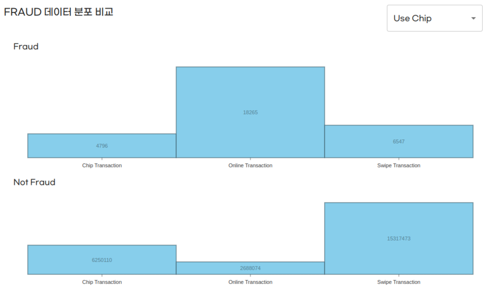

1. Fraud 데이터 Use Chip 칼럼의 Online Transaction이 유의미하게 큰 비중으로 관측됩니다.

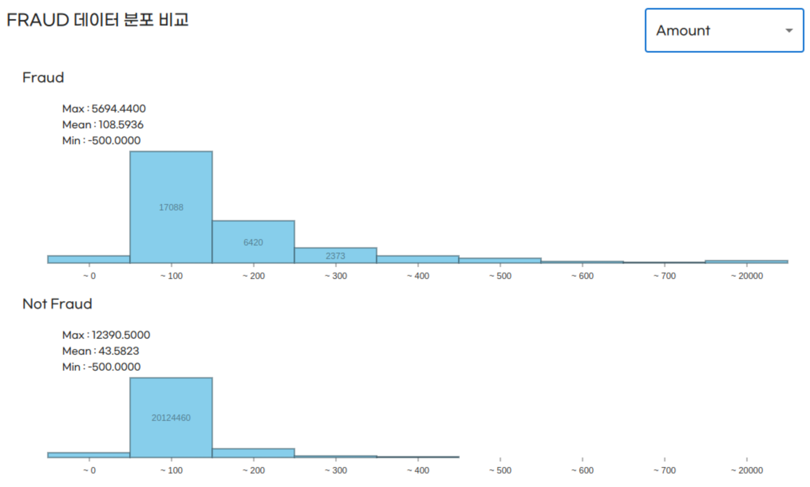

b. Fraud Data의 Amount분포가 정상 데이터에 비해 큰 값으로 관측됩니다.

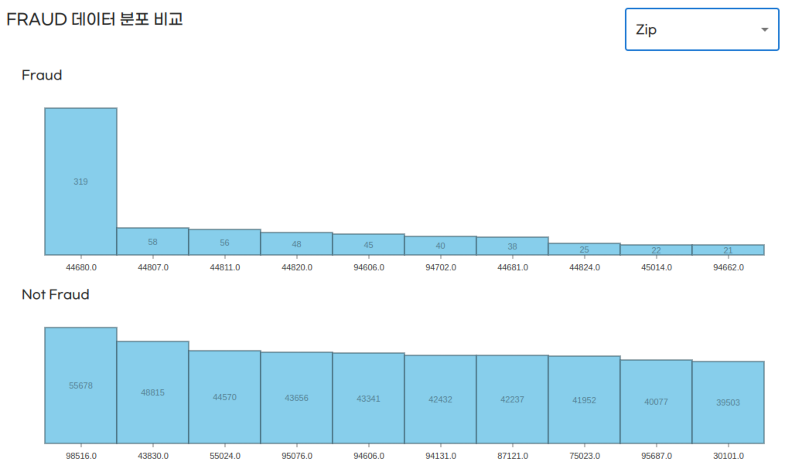

c. Fraud data의 Zip코드 중 44680이 유의미하게 큰 비중으로 관측됩니다.

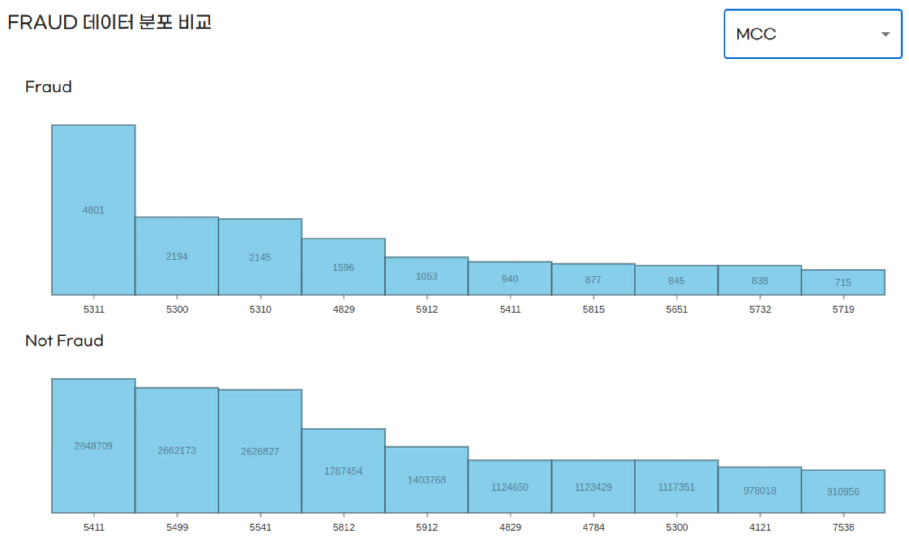

d. Fraud data의 5311 MCC코드가 유의미하게 큰 비중으로 관측됩니다.

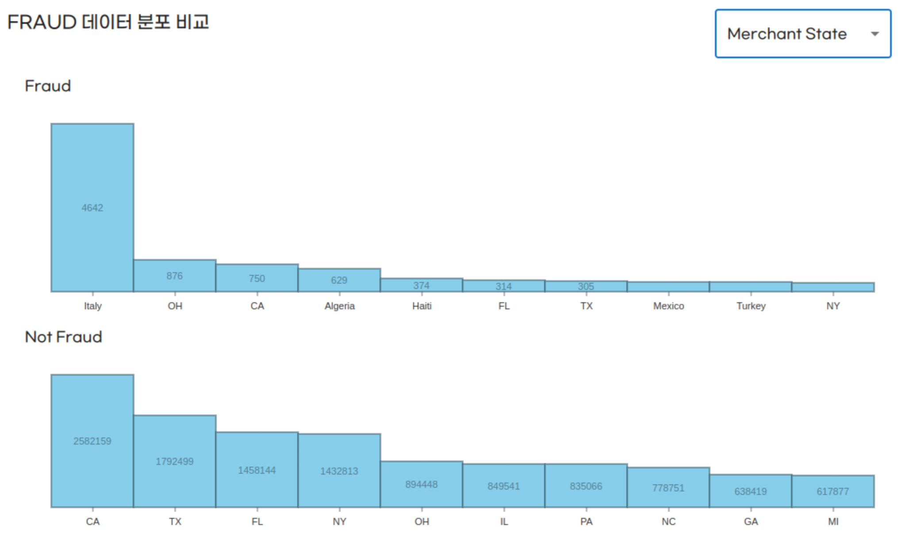

e. Fraud data의 Merchant state 칼럼에 Italy가 유의미하게 큰 비중으로 관측됩니다.

## 사용자 별 시간대 별 결제 빈도 확인

📁 python_codes/eda/per_user_analysis.py

사용자별로 fraud data의 시간대 별 결제 빈도와, not fraud data의 시간대 별 결제 빈도를 비교합니다.

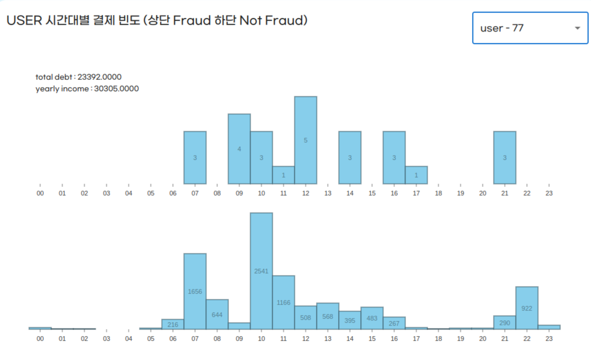

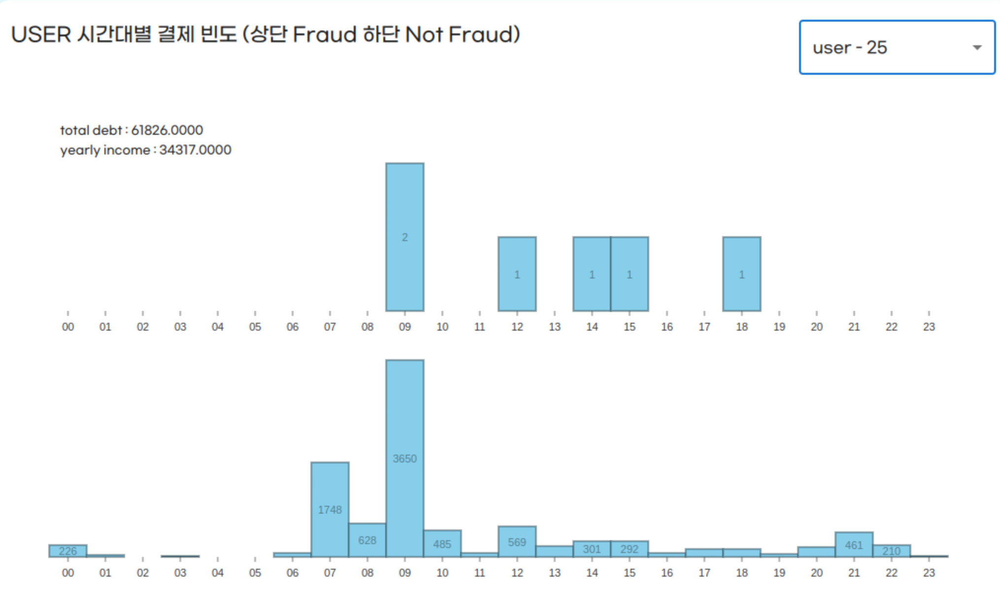

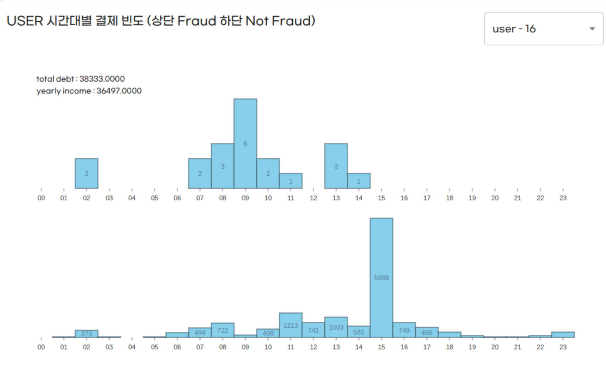

일부 사용자에게서 유의미한 빈도 분포 차이가 있긴했지만 전반적인 사용자들의 부정 거래 발생량 자체가 너무 적었고, 불규칙적이었습니다. 또한, 사용자 별로 특성을 생성할 경우 모델의 확장성이 저해될 수 있어 별도의 작업을 추가하지는 않았습니다.

## 사용자 연령대 별 선호하는 사업장 명(Merchant Name) 파악

📁 python_codes/eda/per_age_analysis.py

각 사용자의 나이를 ~20, ~40, ~60, 60+ 4개의 구간으로 나누고 각 구간에서 가장 많이 거래된 사업장 명을 계산합니다. 계산된 사업장 명은 추후 정상적인 거래를 파악하기 위한 칼럼으로 사용합니다.

# 3. 모델

## preprocessing

📁 python_codes/make_model/model/feature_engineering/preprocessing.py

Transaction data중 날짜를 나타내는 정보 year, month, day는 직관적으로 부정거래 발생과 연관이 없을 거라고 생각했고, 또한 연관이 있다고 하더라도 실제 서비스에서 사용할 수 없는 확장 가능성이 없는 정보이기 때문에 사용하지 않기로 했습니다.

Time, Amount 칼럼은 수치형 데이터로 이용할 수 있도록 각각 “:”마크를 지우고 분단위를 삭제, 달러 사인을 삭제하는 작업을 진행합니다.

User, Card feature를 id를 통해 찾아 merge해주고 id 정보를 삭제합니다.

## feature engineering

### 원핫 칼럼 추가

📁 python_codes/make_model/model/feature_engineering/add_fraud_one_hot.py

EDA과정에서 확인한 fraud 데이터의 유의미한 분포 특징을 원핫칼럼으로 추가합니다.

- Use Chip 칼럼 원핫 인코딩
- Merchant State 가 Italy인 경우 원핫 인코딩
- Zip이 44680인 경우 원핫 인코딩
- MCC가 5311인 경우 원핫 인코딩

### 연령대 특성 추가

📁 python_codes/make_model/model/feature_engineering/generate_age_feature.py

Transaction의 Merchant Name이 사용자가 속한 연령대에서 자주 관측된 값인지를 확인하고 그럴 경우 1, 아니면 0을 값으로 갖는 칼럼을 추가합니다.

### 사용자 특성 추가

📁 python_codes/make_model/model/feature_engineering/generate_user_feature.py

Transaction의 Amount값을 사용자에게 상대적인 값으로 나타내기 위해 사용자의 Yearly Income, Credit Limit, Total Debt 값으로 각각 나눈 값을 칼럼으로 추가합니다.

transaction이 나타난 장소가 사용자의 거주지와 유사한지를 확인하기 위해 사용자의 City가 Transaction의 Merchant city와 같을 경우 1 아닐 경우 0을 갖는 칼럼을 추가합니다.

## Train

### full train

📁 python_codes/make_model/full_train.py, full_train_evaluate.py
train_transactions.csv 파일을 100000 chunk단위로 읽으면서 random forest classifier모델을 additive 하게 학습시키는 방법을 먼저 시도했습니다. 평가 결과 상대적으로 저조한 결과를 얻었습니다.

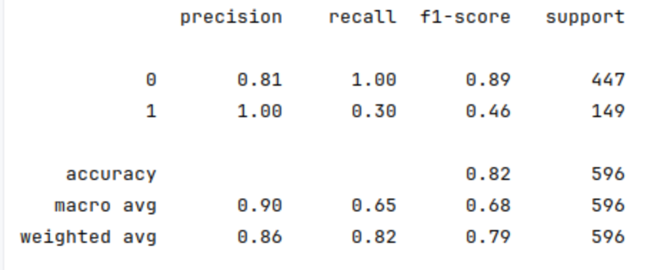

### ensemble train

📁 python_codes/make_model/ensemble_train.py, ensemble_evaluate.py

📁 python_codes/make_model/model/trainer

데이터가 충분히 많기때문에 전체 학습데이터를 이용해서 학습시키기 보다는 fraud 데이터를 오버샘플링해서 학습을 시키는 방향으로 가기로 했습니다.

미리 분리해둔 fraud data 약 3만 row와 함께 not fraud data를 10만 row씩 읽으면서 데이터 비율을 3대10으로 맞춰 모델을 각각 학습시키는 방식을 선택했습니다. not fraud data는 랜덤으로 추출하기 위해 미리 shuffle해놓은 데이터를 이용했습니다.

학습 과정은 다음과 같습니다.

- 탐색할 config space를 정의한다.
- 주어진 약 13만 row의 데이터를 6개의 데이터로 분리한다.
- 1개의 데이터는 모델 평가를 위한 hold-out set으로 남겨 놓는다.
- Bayesian optimization방식으로 탐색할 config space에서 모델 및 하이퍼파라미터를 선정한 후 5개의 데이터 블록을 이용해 cross validation을 진행합니다.
- 위의 과정에서 평균 loss가 가장 적은 모델을 선정합니다.
- 선정된 모델의 config정보로 새 모델을 만든 후 5개 블록 모두를 학습시킵니다.
- hold-out 블록을 이용해 선정된 모델을 평가합니다.
- 마지막으로 선정된 모델에 전체 데이터를 학습시키고 반환합니다.

초기에는 전체 not fraud data 2400만 row를 10만개씩 읽으며 240개의 모델을 학습시키는 방법을 적용했습니다. 모델 또한, bagging방식의 randomforest classifier, boosting방식의 lightGBM모델을 각각 채택한 후 hyperparameter optimization 작업을 진행했습니다.

여러번의 heuristic한 ensemble 모델 학습과 평가를 진행한 후, 데이터가 충분히 많아 240개까지의 모델이 필요없다는 점, random forest모델이 유의미하게 긴 학습시간을 요청하는 데에 비해 성능이 밀리는 점, 추후 배포과정에서 모델의 파일 사이즈가 적은 것이 유리하다는 점 등을 파악하고 감안하여 최종적인 hyperparameter config space를 정의했습니다.

최종적으로 LightGBM 모델 10개를 학습시켜 평가했습니다.

## 모델 평가

초기 단계에서 미리 만들어놓은 사용자 1990~1999의 정보에서 447개의 not fraud 데이터, 149개의 fraud데이터를 추출하여 모델을 평가했습니다.

모델의 추론 방식은 10개의 모델이 각각 fraud일 확률을 추론하고, 그 확률을 평균 낸 후, 정한 threshold 이상의 값일 경우 1을 아닐 경우 0을 반환하는 식으로 진행했습니다.

threshold 값에 따른 평가 결과는 아래와 같습니다.

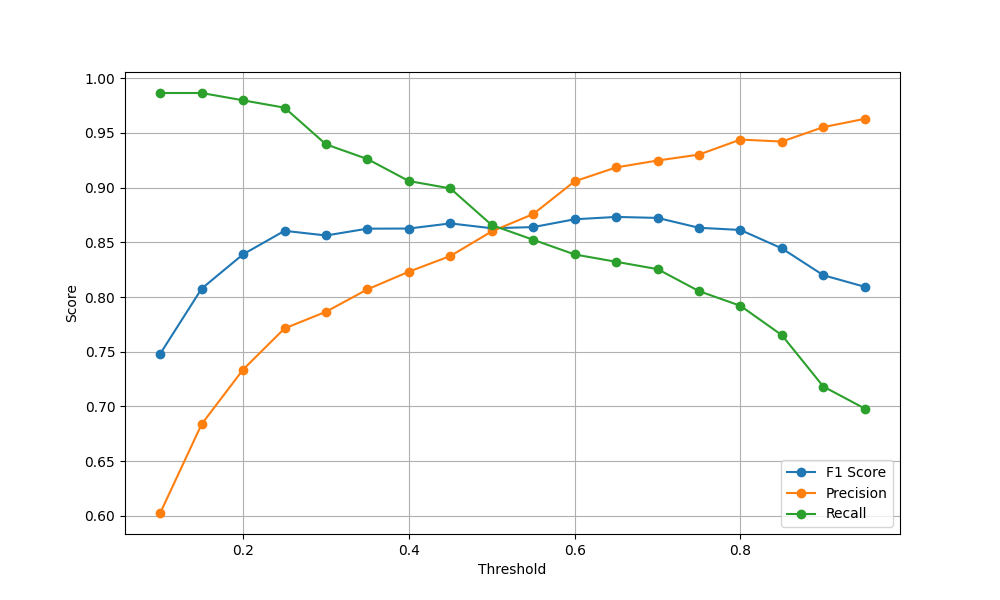

가장 균형 잡힌 값을 갖는 0.5를 threshold로 잡고 평가할 경우 아래와 같은 결과를 얻었습니다.

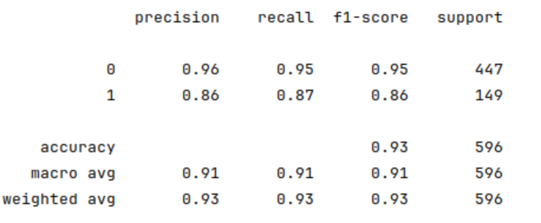

# 4. 추론 API 서버 개발

API 서버는 크게 kserve inference service를 사용한 방식과 사용하지 않은 방식 두 가지로 나누어 구현하였습니다. 각각 api_server_v1, v2 폴더에 있으며, frontend 폴더에 있는 별도의 프론트엔드 이미지 및 mysql 이미지와 함께 kubernetes 환경에 배포할 수 있는 helm 차트를 같이 구현했습니다.

백엔드, 추론 서버, 프론트엔드 이미지는 docker hub에 저장하였으며, 이미지 저장은 각 폴더의 build_push.sh 스크립트를 이용해 진행했습니다.

## api_server_v1

Fast API + MySQL

Fast API 백엔드와 MySQL 데이터베이스를 이용한 기본적인 추론 서비스입니다.

추론 API 서버를 개발하는 데 있어서는 최대한 실제 제공하는 추론 서비스와 유사한 형태로 제공할 수 있도록 구현하는 것을 우선시하여 구현하였습니다. 모델 개발에 사용한 transaction, user, card data는 실제 서비스 구현 상에서는 데이터베이스의 transaction fact table과 user, card dimension table 구조일 것이라고 생각했습니다. 따라서 user, card의 feature를 나타내는 파일은 미리 DB에 저장하여 실제로 구현될 경우 db에 새로운 user, card정보가 축적되는 상황에 대응할 수 있도록 구현하였습니다.

모델 파일과 패키지의 경우 파일은 디비에 업로드 하는 방식, 패키지의 경우는 pypi 등 패키지 저장소에 업로드한 후 설치하여 사용하는 방식을 채택할 수 있겠지만, 단기간에 개발해야하는 현 과제의 특성상 파일 자체를 도커 이미지에 복사하여 사용하는 방식으로 구현했습니다.

서버 시작시 csv 파일 두 개를 DB에 저장하고 모델 pickle파일을 읽어 메모리에 로드해놓습니다.

추론 요청이 들어오면 transaction 정보에서 user id와 card id를 이용해 DB에서 각각의 정보를 로드하고 merge하여 서버 생성시 로드한 모델을 이용해 추론을 진행합니다.

.png>)

## api_server_v2

Fast API + MySQL + Kserve inference service

v1에서 모델 패키지 및 관련 정보를 kserve inference service로 분리한 구조입니다.

inference service를 별도로 생성하며 사전에 정의한 추론 용 이미지에 모델 패키지와 모델 pickle파일이 포함돼있는 구조입니다.

추론 과정에 있어 v1과 조금 차이가 있습니다. user, card정보를 DB에서 찾은 후 inference service에 transaction정보와 함께 전송합니다. inference service는 전송받은 요청을 처리한 후 결과를 추론 서버에 반환해주고 서버가 다시 추론 결과를 요청자에게 반환해줍니다.

inference service를 별도로 정의할 경우, 배포 환경에서 메모리를 분리하여 할당할 수 있고, 모델 관련 부분을 백엔드 서버와 분리하여 운영할 수 있어 유연성과 확장성에 강점을 가질 수 있습니다.

또한 추가적으로 설정에 따라 auto scaling, 모니터링 등의 기능을 사용할 수도 있습니다.

다만 kserve와 관련 모듈(istio, cert manager, knative-serving) 등을 설치하여 운영해야합니다.

.png>)

개발한 api-server v1은 배포하여 [http://101.101.216.237:31233/](http://101.101.216.237:31233/) 에서 테스트할 수 있습니다.

EDA 차트 확인

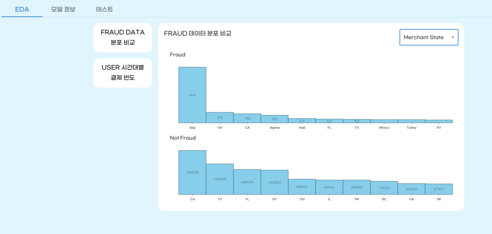

모델 정보 확인

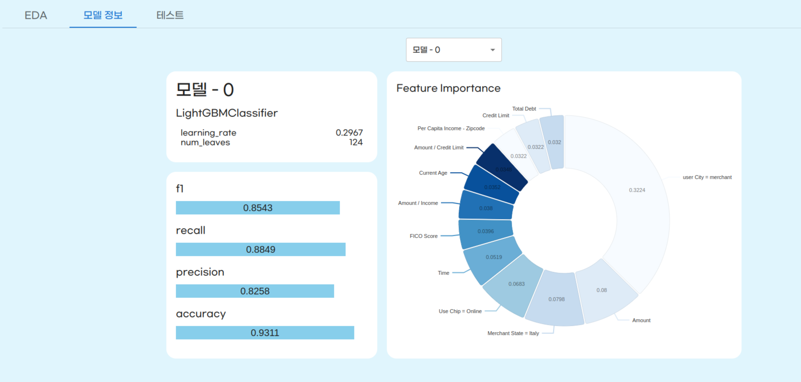

테스트 확인

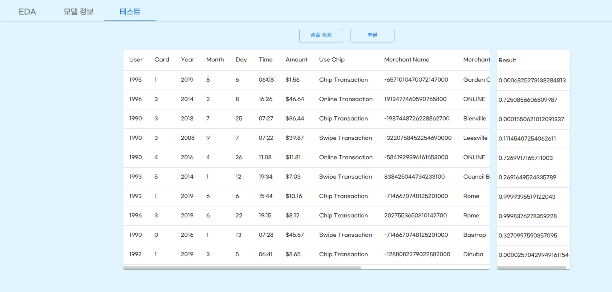
